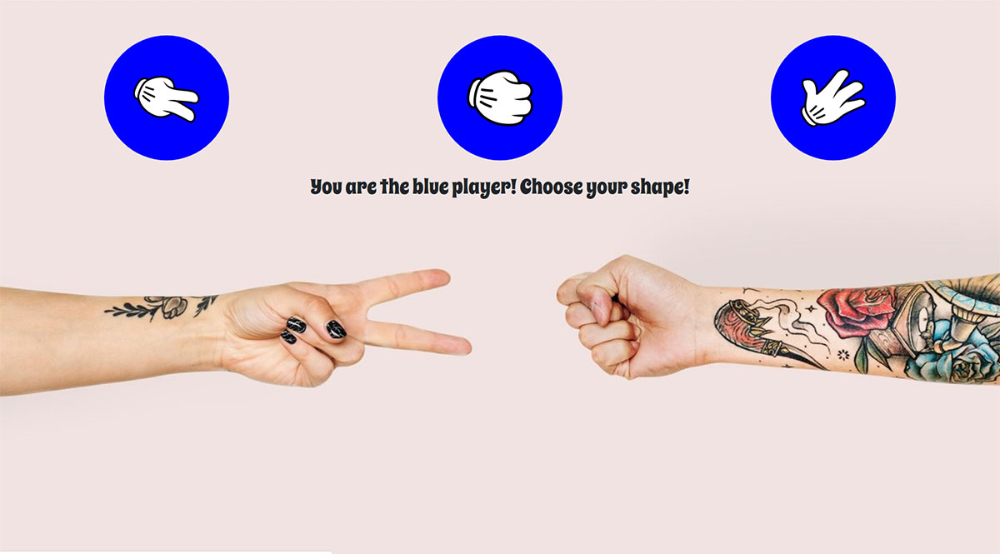

# One of my favorite pastime games turned into a web app



One of my first react apps created with [Create React App](https://github.com/facebook/create-react-app).
Used react, react-router, reactstrap, sass.

## App Info

```bash

# Clone the repository
https://github.com/mihneavlad/react-scissors-rock-paper.git

# Install dependencies
npm install

# Run it
npm run start

```


## Features

Play against the Computer, choose at anytime a different symbol.

### Author

Mihnea Vlad


